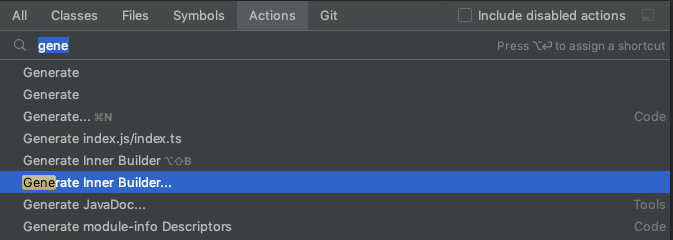

# innerbuilder-generator-intellij-plugin


[](https://plugins.jetbrains.com/plugin/15615-innerbuilder-generator)
[](https://plugins.jetbrains.com/plugin/15615-innerbuilder-generator)

## Description 

<!-- Plugin description -->
Generates an inner builder class to a data class / DTO.
Supports recreation: just add a field to the data class and run generate again.
<br>

You can configure the generator using the action "Generate Inner Builder...".
The settings are saved and survive IDE restarts.
To quickly generate a builder with the previously selected settings, just hit `shift alt B`.

Check out the screenshots and examples here: https://github.com/janneri/innerbuilder-generator-intellij-plugin
<!-- Plugin description end -->

## About data classes and DTOs

The idea behind this generator is that a DTO is
- A simple class that holds data and nothing more
- The fields are public final fields (immutability)
- Because of public final fields, contains no getters
- Because of immutability and the generated builder, contains no setters

I know this topic is highly opinionated. The way we write data classes depends on the conventions established in you project.
That's why we have so many variations of the builder pattern (and plugins)
and you can pick the one, that suits your opinions. To some extent, we can alleviate the problem by making
the builder generator configurable. Check out the examples below to see more details.

## Example

Please note: many times the data classes that actually benefit from the builder pattern have more fields, 
but let's keep it simple here and use just two fields. 

First you write this:
```
public class Department {
    public final String departmentName;
    public final int employeeCount;
}
```

Then you use the quick action dialog with `ctrl+shift+a` and select <kbd>Generate inner builder...</kbd>



You configure the generator and hit OK.


The end result with the above settings looks like this. 
Please note that you can remove or add fields and hit `alt+shift+b` to regenerate and update everything.

```
@JsonDeserialize(builder = Department.Builder.class)
public class Department {
    public final String departmentName;
    public final int employeeCount;

    private Department(Builder builder) {
        departmentName = builder.departmentName;
        employeeCount = builder.employeeCount;
    }

    public static Builder builder() {
        return new Builder();
    }

    public static Builder copy(Department src) {
        Builder builder = new Builder();
        builder.departmentName = src.departmentName;
        builder.employeeCount = src.employeeCount;
        return builder;
    }

    @JsonPOJOBuilder(withPrefix = "")
    public static class Builder {
        private String departmentName;
        private int employeeCount;

        private Builder() {
        }

        public Builder departmentName(String departmentName) {
            this.departmentName = departmentName;
            return this;
        }

        public Builder employeeCount(int employeeCount) {
            this.employeeCount = employeeCount;
            return this;
        }

        public Department build() {
            return new Department(this);
        }
    }
}
```


## Installation

- Using IDE built-in plugin system:
  
  <kbd>Preferences</kbd> > <kbd>Plugins</kbd> > <kbd>Marketplace</kbd> > <kbd>Search for "innerbuilder-generator-intellij-plugin"</kbd> >
  <kbd>Install Plugin</kbd>
  
- Manually:

  Download the [latest release](https://github.com/janneri/innerbuilder-generator-intellij-plugin/releases/latest) and install it manually using
  <kbd>Preferences</kbd> > <kbd>Plugins</kbd> > <kbd>⚙️</kbd> > <kbd>Install plugin from disk...</kbd>


---
Plugin based on the [IntelliJ Platform Plugin Template][template].

[template]: https://github.com/JetBrains/intellij-platform-plugin-template
